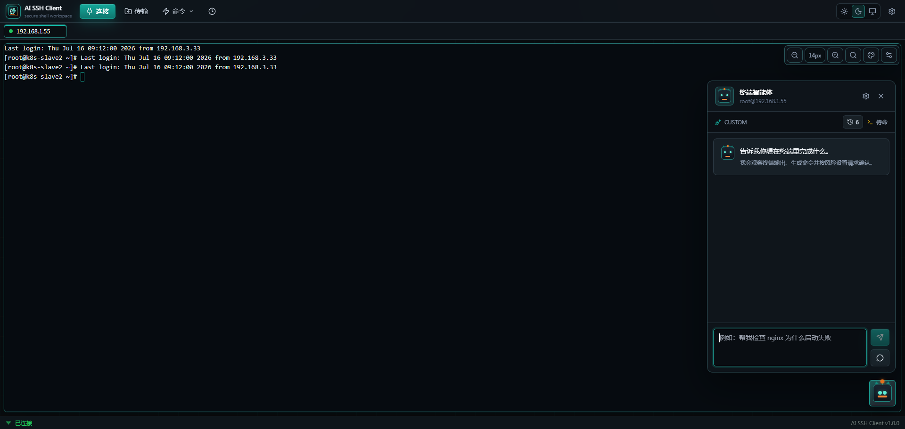
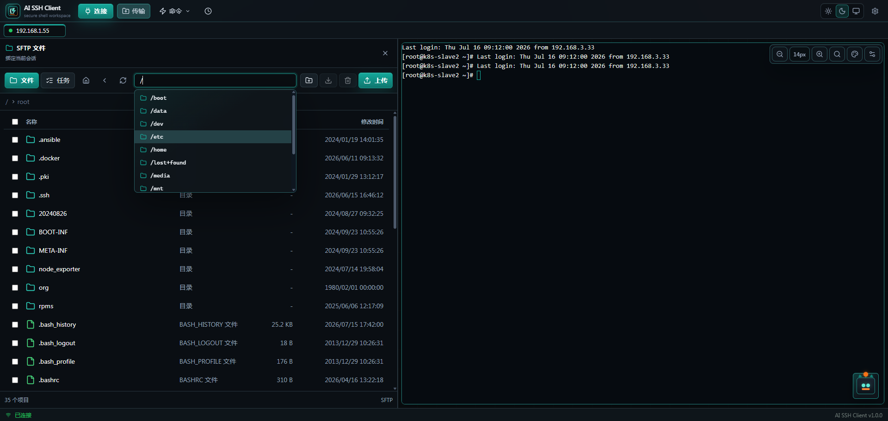

<div align="center">

# AI SSH Client

**A desktop SSH client that unifies multi-session terminals, SFTP transfers, and AI-assisted Linux command workflows.**

English | [简体中文](README.zh-CN.md)

[](https://github.com/YUYUY9527/ai-ssh-client/actions/workflows/ci.yml)
[](LICENSE)
[](https://github.com/YUYUY9527/ai-ssh-client/releases)
[](https://tauri.app/)

</div>

> Built with React, Tauri, Rust, TypeScript, xterm.js, and Tailwind CSS.

## Table of Contents

- [Features](#features)
- [Screenshots](#screenshots)
- [Install](#install)
- [Getting Started](#getting-started)
- [Usage](#usage)
- [Keyboard Shortcuts](#keyboard-shortcuts)
- [Docker / Web Deployment](#docker--web-deployment)
- [Security](#security)
- [Tech Stack](#tech-stack)
- [Project Structure](#project-structure)
- [Development](#development)
- [Data and Backups](#data-and-backups)
- [Contributing](#contributing)
- [License](#license)

## Features

- **Multi-session SSH** — password and private-key auth, reconnect, keepalive, tab switching, and tab reordering.
- **Rich terminal** — xterm.js with search, font-size controls, theme selection, command autocomplete, command history, and configurable scrollback.
- **Session-bound SFTP** — a sidebar workspace tied to the active session for listing, uploading, downloading, editing files, changing permissions, and tracking transfer progress.
- **AI assistant & agent** — natural-language Linux command help and guided task execution.
- **Multiple AI providers** — OpenAI-compatible endpoints, Anthropic, Gemini, and Ollama.
- **Guardrails** — command risk analysis with approval gates for dangerous operations, plus execution logging.
- **Host fingerprint verification** — SHA-256 host-key check with a trust-on-first-use prompt.
- **Quick commands** — reusable shell snippets organized into groups.
- **Themes** — light, dark, and system.
- **Portable config** — import and export application configuration.
- **Local secret storage** — SSH credentials and AI API keys kept in the platform keyring.

## Screenshots

<div align="center">
  
  <br /><br />
  
</div>

## Install

Download the latest installer from the
[**Releases**](https://github.com/YUYUY9527/ai-ssh-client/releases) page.

- **Windows** — download and run the `.exe` (NSIS) installer.
- **macOS / Linux** — build from source (see [Development](#development)); prebuilt artifacts are planned.

> Windows may warn about an unknown publisher until code signing is in place.

## Getting Started

```bash
# install dependencies
npm install

# start the development app
npm run dev

# build the desktop app
npm run build
```

## Usage

1. Create an SSH connection from the connection menu.
2. Enter host, port, username, and either a password or private key.
3. Connect to open a terminal tab.
4. Configure and activate an AI provider from the AI panel settings.
5. Ask the assistant for Linux command help, or use agent mode to execute a task through guarded command steps.
6. Once connected, open the SFTP sidebar to browse and transfer remote files.

## Keyboard Shortcuts

| Shortcut | Action |
| --- | --- |
| `Ctrl+F` | Search terminal output |
| `Ctrl++` | Increase terminal font size |
| `Ctrl+-` | Decrease terminal font size |
| `Esc` | Close terminal search or autocomplete |

## Docker / Web Deployment

**Docker Compose is the recommended way to run the web deployment.** It wires up
container networking and the persistent data volume for you, so you avoid the
manual configuration and easy-to-miss security steps of a raw
`node server/index.cjs` run.

```bash
docker compose up -d --build
```

Open <http://localhost:5080>. Set `AI_SSH_CLIENT_WEB_PORT` to use another host
port. From another device on the same LAN, open `http://<laptop-ip>:5080` —
browsers block unsafe downloads on plain-HTTP origins, so enable the built-in
HTTPS listener (`AI_SSH_CLIENT_WEB_TLS=1`) if SFTP downloads must work from
other machines. See
[Network binding and TLS](#network-binding-and-tls).

The Compose deployment runs a Node web gateway that serves the React renderer
and opens SSH/SFTP connections from the machine running Docker. Connection data
is stored in the `ai-ssh-client-data` Docker volume.

The terminal, SFTP transfers, AI assistant, and agent mode all work in the web
deployment. The gateway keeps these on par with the desktop app by verifying
SSH host keys before authenticating and by encrypting stored credentials at rest
— see [SECURITY.md](SECURITY.md) for the trust model.

### Host key confirmation

Like the desktop app, the gateway asks you to confirm a host's key fingerprint
the first time you connect (and again if the key ever changes). The prompt
appears in the page that started the connection, so keep the tab open while a
new host is being verified; the request fails after 90 seconds without an
answer.

For unattended deployments with no browser attached, set
`WEB_SSH_TRUST_ON_FIRST_USE=true` to trust and record hosts that have no record
yet. A **changed** key is still rejected in that mode.

### Password authentication

The web gateway requires a password. Every request and WebSocket connection must
carry a valid session before it can reach the SSH/SFTP APIs; unauthenticated
visitors get a sign-in page instead of the app.

- **Default password** — on first start the gateway initializes with the
  password `admin` and stores a salted hash in the data volume (never the plain
  text). Sign in with `admin`, then open **Settings → Password** to change it.
  A banner reminds you to do so while the default is still in use.

- **Change it from the UI** — the in-app password change verifies your current
  password, persists the new hash, and keeps your current session signed in
  while invalidating any other sessions.

- **Pin a password via environment** — set `AI_SSH_CLIENT_WEB_PASSWORD` (passed
  through to the container as `WEB_AUTH_PASSWORD`) to manage the password
  entirely through configuration. In this mode the password is not stored on
  disk and cannot be changed from the UI:

  ```bash
  AI_SSH_CLIENT_WEB_PASSWORD='a-long-strong-password' docker compose up -d --build
  ```

Open the page, enter the password once, and a session cookie keeps you signed
in.

### Credential storage

Connection passwords, private keys, passphrases, and AI API keys are encrypted
(AES-256-GCM) before being written to `config.json` in the data volume. The
encryption key depends on how the password is managed:

- **`WEB_AUTH_PASSWORD` set** — the key is derived from that password and is
  never written to disk. A stolen data volume cannot be decrypted. This is the
  strongest option and the one to prefer for shared or internet-facing
  deployments.
- **Otherwise** — a random key is generated and kept in `data/secret.key`
  (mode `0600`). This protects against `config.json` being copied, backed up, or
  accidentally committed, but not against an attacker who can read the entire
  data directory, since the key sits next to the data.

Existing plaintext `config.json` files keep working and are re-encrypted on the
next write — no manual migration step. If you later change
`WEB_AUTH_PASSWORD` (or lose `secret.key`), previously stored secrets can no
longer be decrypted; the affected connections show an empty password and must be
filled in again.

### Network binding and TLS

- **Desktop / local `node server/index.cjs`** — the server binds to
  `127.0.0.1` by default, so it is reachable only from the local machine. Set
  `WEB_HOST=0.0.0.0` to expose it on the network. Under Docker this is already
  set inside the container, with the host port controlled by Compose.
- **The password travels in plain text over HTTP.** On a LAN this is usually
  acceptable, but anywhere the traffic could be observed you should terminate
  TLS in front of the gateway (a reverse proxy such as Caddy, Nginx, or
  Traefik). The session cookie is automatically marked `Secure` when the request
  arrives over HTTPS (including via `X-Forwarded-Proto` from a proxy).

#### Built-in HTTPS (recommended on a LAN)

Browsers (Chrome) classify downloads as *insecure* when the page origin is not
trustworthy and the file extension is not on their small safe list. On
`http://<lan-ip>:5080` an SFTP download therefore finishes with no file and no
in-app error: the console only shows
`The file at 'http://…' was loaded over an insecure connection…` and the download
bubble reports a blocked insecure download. `.pcap`, `.zip`, `.conf` and most
other ops file types are outside that safe list, so **this is browser security
policy, not a broken SFTP transfer**. Serving the page over HTTPS fixes it for
good (https is a potentially trustworthy origin). The gateway supports both:

```bash
# Option 1: self-signed certificate, generated with openssl on first start
# and stored in the data volume (/data/tls)
AI_SSH_CLIENT_WEB_TLS=1 docker compose up -d --build
# then browse https://<ip>:5080 and accept the certificate warning once
```

```yaml
# Option 2: bring your own PEM certificate — no WEB_TLS=1 needed
services:
  ai-ssh-client-web:
    volumes:
      - ./certs:/certs:ro
    environment:
      WEB_TLS_CERT: /certs/fullchain.pem
      WEB_TLS_KEY: /certs/privkey.pem
```

- `WEB_TLS=1` — generates a self-signed certificate when no certificate is
  provided. The SAN always covers `localhost`, `127.0.0.1` and every non-loopback
  IPv4 of the machine; add domains or fixed IPs with
  `WEB_TLS_HOSTS=ssh.example.com,192.168.4.213`.
- `WEB_TLS_REGENERATE=1` — force regeneration of the self-signed certificate
  (for example after the accessed IP changed).
- Certificates live in `DATA_DIR/tls/` (the `/data/tls` volume under Docker) and
  are regenerated when deleted.
- Running `node server/index.cjs` directly (no Docker) needs `openssl` on the
  host for the self-signed mode; otherwise generate a local certificate with
  [mkcert](https://github.com/FiloSottile/mkcert) and point `WEB_TLS_CERT` /
  `WEB_TLS_KEY` at it.

Temporary workarounds when you cannot enable HTTPS: allow "Insecure content" for
the site in Chrome's site settings, or tunnel the port and use
`http://localhost:5080`, which is a trustworthy origin.

<details>
<summary>Example: Caddy reverse proxy with automatic HTTPS</summary>

Run the gateway bound to loopback (or an internal Docker network) and let Caddy
handle TLS. A minimal `Caddyfile`:

```caddyfile
ssh.example.com {
    reverse_proxy 127.0.0.1:5080
}
```

Caddy provisions and renews a certificate automatically and forwards
`X-Forwarded-Proto: https`, so the gateway issues a `Secure` session cookie.

</details>

> ⚠️ **Do not expose this service directly to an untrusted network without
> TLS.** The web gateway can open SSH connections using stored credentials.
> The password protects it, but over plain HTTP that password can be
> intercepted. Put it behind HTTPS for any internet-facing deployment, and
> change the default password immediately. See [SECURITY.md](SECURITY.md).

<details>
<summary>Import saved connections into the web deployment</summary>

```powershell
Invoke-RestMethod `
  -Uri http://localhost:5080/api/import `
  -Method Post `
  -ContentType application/json `
  -InFile .\connections.json
```

Minimum JSON shape:

```json
{
  "connections": [
    {
      "id": "server-1",
      "name": "server-1",
      "host": "192.168.1.10",
      "port": 22,
      "username": "root",
      "password": "your-password"
    }
  ]
}
```

For the Tauri desktop app, connection metadata is stored in
`%LOCALAPPDATA%\ai-ssh-client\store.json`, but passwords, private keys, and
passphrases live in Windows Credential Manager and are not in that file. Import
the metadata, then edit the connection in the web page to fill in the secret.

</details>

## Security

- The renderer reaches the backend only through the Tauri command bridge.
- SSH passwords, private keys, passphrases, and AI API keys are stored separately from normal configuration data.
- Sensitive data is kept in the local Tauri/Rust storage layer and the platform keyring where available.
- Private-key files are read only after selection through the native file picker.
- Agent-driven command execution passes through command risk checks and execution logging.

To report a vulnerability, see [SECURITY.md](SECURITY.md). Please do not open a
public issue for security problems.

## Tech Stack

| Layer | Technology |
| --- | --- |
| Desktop runtime | Tauri 2 |
| Backend | Rust (russh / russh-sftp) |
| UI | React + TypeScript |
| Build | Vite |
| Terminal | xterm.js |
| State | Zustand |
| Styling | Tailwind CSS |
| Storage | Tauri app data + platform keyring |

## Project Structure

```text
ai-ssh-client/
├── src-tauri/            # Tauri/Rust backend
│   └── src/
│       ├── commands/     # Tauri command handlers
│       ├── models/       # Rust data contracts
│       └── services/     # SSH, SFTP, AI, agent, and storage services
├── src/
│   ├── renderer/         # React renderer (domain-organized)
│   │   ├── session/      # Session model, terminal, recovery
│   │   ├── transfer/     # SFTP browser, sidebar, transfer tasks
│   │   ├── workspace/    # Tabs, layout, workspace store
│   │   ├── assistant/    # AI assistant + risk approval
│   │   ├── agent/        # Agent runtime
│   │   └── store/        # Zustand stores
│   └── shared/           # Shared types and constants
├── server/               # Optional Node web gateway (Docker)
├── docs/                 # Architecture notes
└── scripts/              # Node verification scripts
```

## Development

**Prerequisites:** Node.js 20+, the stable Rust toolchain, and the
[Tauri 2 platform dependencies](https://tauri.app/start/prerequisites/).

| Command | Description |
| --- | --- |
| `npm run dev` | Start the Tauri development app |
| `npm run build` | Build the Tauri application |
| `npm run build:renderer` | Build the renderer bundle only |
| `npm run preview` | Preview the renderer bundle |
| `npm run typecheck` | Type-check the renderer |
| `npm run check` | Typecheck + script tests + renderer build |
| `npm run test:rust` | Run the Rust backend tests |
| `npm run dist:win` | Build Windows distributables |

Run `npm run check` and `npm run test:rust` before opening a pull request.

## Data and Backups

Connection metadata, settings, quick commands, and AI provider metadata are
stored locally through the Tauri/Rust storage service. Sensitive SSH and AI
secrets are stored separately. Use the import/export tools in settings to back
up or restore portable configuration data.

## Contributing

Contributions are welcome. Please read [CONTRIBUTING.md](CONTRIBUTING.md) and the
[Code of Conduct](CODE_OF_CONDUCT.md) before getting started.

## License

[MIT](LICENSE) © YUYUY9527
