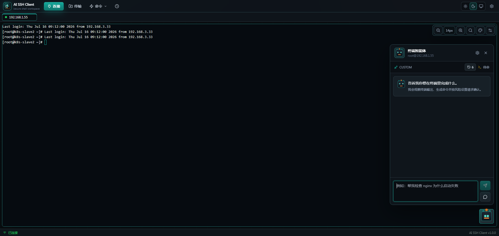
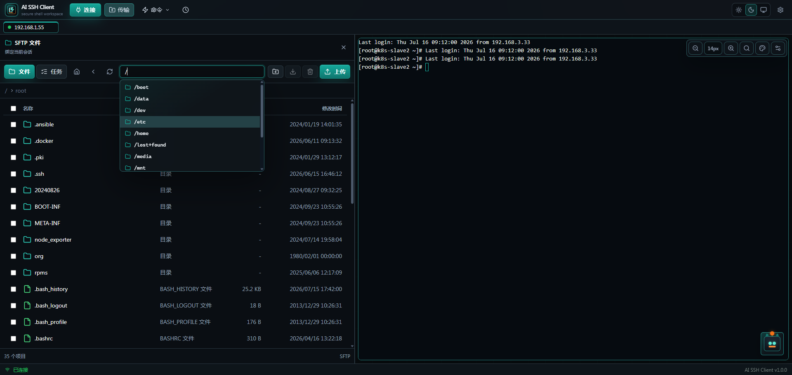

<div align="center">

# AI SSH Client

**集多会话终端、SFTP 文件传输与 AI 辅助 Linux 命令工作流于一体的桌面 SSH 客户端。**

[English](README.md) | 简体中文

[](https://github.com/YUYUY9527/ai-ssh-client/actions/workflows/ci.yml)
[](LICENSE)
[](https://github.com/YUYUY9527/ai-ssh-client/releases)
[](https://tauri.app/)

</div>

> 基于 React、Tauri、Rust、TypeScript、xterm.js 和 Tailwind CSS 构建。

## 目录

- [功能特性](#功能特性)
- [界面截图](#界面截图)
- [安装](#安装)
- [快速开始](#快速开始)
- [使用流程](#使用流程)
- [快捷键](#快捷键)
- [Docker / Web 部署](#docker--web-部署)
- [安全](#安全)
- [技术栈](#技术栈)
- [项目结构](#项目结构)
- [开发](#开发)
- [数据与备份](#数据与备份)
- [参与贡献](#参与贡献)
- [许可证](#许可证)

## 功能特性

- **多会话 SSH** —— 支持密码与私钥认证、重连、Keepalive、标签切换和拖拽排序。
- **强大的终端** —— 基于 xterm.js，支持搜索、字体调节、终端主题、命令补全、命令历史和可配置回滚缓冲。
- **会话绑定 SFTP** —— 与当前会话绑定的侧栏工作区，支持列目录、上传、下载、在线编辑、改权限和传输进度跟踪。
- **AI 助手与智能体** —— 自然语言 Linux 命令咨询与受控的任务执行。
- **多 AI 供应商** —— OpenAI 兼容接口、Anthropic、Gemini 和 Ollama。
- **安全护栏** —— 命令风险分析，高风险操作进入审批流程，并记录执行日志。
- **主机指纹校验** —— SHA-256 主机密钥校验，首次连接信任（TOFU）提示。
- **快速命令** —— 可复用的 Shell 片段，支持分组管理。
- **主题** —— 浅色、深色、跟随系统。
- **可移植配置** —— 应用配置导入与导出。
- **本地密钥存储** —— SSH 凭据与 AI API Key 保存在平台 keyring 中。

## 界面截图

<div align="center">
  
  <br /><br />
  
</div>

## 安装

从 [**Releases**](https://github.com/YUYUY9527/ai-ssh-client/releases) 页面下载最新安装包。

- **Windows** —— 下载并运行 `.exe`（NSIS）安装程序。
- **macOS / Linux** —— 目前需从源码构建（见[开发](#开发)），预编译产物在计划中。

> 在完成代码签名前，Windows 可能提示"未知发布者"。

## 快速开始

```bash
# 安装依赖
npm install

# 启动开发模式
npm run dev

# 构建桌面应用
npm run build
```

## 使用流程

1. 在连接菜单中新建 SSH 连接。
2. 填写主机、端口、用户名，并选择密码或私钥认证。
3. 点击连接，打开对应终端标签页。
4. 在 AI 面板中配置并激活 AI 供应商。
5. 在助手模式中咨询 Linux 命令，或在智能体模式中让 AI 通过受控命令步骤完成任务。
6. 连接成功后，打开 SFTP 侧栏浏览和传输远程文件。

## 快捷键

| 快捷键 | 功能 |
| --- | --- |
| `Ctrl+F` | 搜索终端输出 |
| `Ctrl++` | 放大终端字体 |
| `Ctrl+-` | 缩小终端字体 |
| `Esc` | 关闭终端搜索或命令补全面板 |

## Docker / Web 部署

**推荐使用 Docker Compose 部署 Web 版。** 它会自动帮你配置容器网络和持久化
数据卷，省去手动运行 `node server/index.cjs` 时繁琐且容易遗漏的安全配置步骤。

```bash
docker compose up -d --build
```

访问 <http://localhost:5080>。如需修改宿主机端口，可设置
`AI_SSH_CLIENT_WEB_PORT`。局域网内其他设备访问 `http://<笔记本IP>:5080`。

Compose 部署会在同一个容器中运行 Node Web 网关并提供 React 页面，由运行
Docker 的机器发起 SSH/SFTP 连接。连接数据保存在 `ai-ssh-client-data` Docker
volume 中。AI 助手和智能体模式在 Web 部署中仍仅桌面端可用。

### 密码鉴权

Web 网关要求密码。每个请求和 WebSocket 连接都必须携带有效会话才能访问
SSH/SFTP 接口；未鉴权的访客只会看到登录页，而不是应用本身。

- **默认密码** —— 首次启动时网关以密码 `admin` 初始化，并将加盐哈希（而非明文）
  保存到数据卷。用 `admin` 登录后，打开 **设置 → 密码** 修改。默认密码仍在使用
  时，页面顶部会有横幅提醒你尽快修改。

- **在界面中修改** —— 应用内改密会校验当前密码、持久化新哈希，并在保持当前会话
  登录的同时使其它会话失效。

- **通过环境变量固定密码** —— 设置 `AI_SSH_CLIENT_WEB_PASSWORD`（会以
  `WEB_AUTH_PASSWORD` 传入容器）即可完全用配置管理密码。此模式下密码不落盘，
  也无法在界面中修改：

  ```bash
  AI_SSH_CLIENT_WEB_PASSWORD='一个足够长的强密码' docker compose up -d --build
  ```

打开页面，输入一次密码，之后会话 Cookie 会保持登录状态。

### 网络绑定与 TLS

- **桌面 / 本地 `node server/index.cjs`** —— 服务默认绑定 `127.0.0.1`，只能从
  本机访问。设置 `WEB_HOST=0.0.0.0` 才会对外暴露。在 Docker 中容器内已设为
  `0.0.0.0`，宿主机端口由 Compose 控制。
- **密码是以明文经 HTTP 传输的。** 在局域网内通常可以接受，但只要流量可能
  被监听，就应在网关前面做 TLS 终止（使用 Caddy、Nginx、Traefik 等反向代理）。
  当请求经由 HTTPS 到达时（包括反代传入的 `X-Forwarded-Proto`），会话 Cookie
  会自动带上 `Secure` 标志。

<details>
<summary>示例：使用 Caddy 反向代理自动启用 HTTPS</summary>

让网关绑定在 loopback（或 Docker 内网），由 Caddy 负责 TLS。最小
`Caddyfile`：

```caddyfile
ssh.example.com {
    reverse_proxy 127.0.0.1:5080
}
```

Caddy 会自动申请并续期证书，并转发 `X-Forwarded-Proto: https`，网关据此下发
`Secure` 会话 Cookie。

</details>

> ⚠️ **在没有 TLS 的情况下，不要将该服务直接暴露到不可信网络。** Web 网关可以
> 使用保存的凭据发起 SSH 连接。密码能提供保护，但在明文 HTTP 下该密码可能
> 被截获。任何面向公网的部署都请置于 HTTPS 之后，并第一时间修改默认密码。详见
> [SECURITY.md](SECURITY.md)。

<details>
<summary>向 Web 版导入已有连接</summary>

```powershell
Invoke-RestMethod `
  -Uri http://localhost:5080/api/import `
  -Method Post `
  -ContentType application/json `
  -InFile .\connections.json
```

JSON 最小格式：

```json
{
  "connections": [
    {
      "id": "server-1",
      "name": "server-1",
      "host": "192.168.1.10",
      "port": 22,
      "username": "root",
      "password": "your-password"
    }
  ]
}
```

对于 Tauri 桌面版，连接元数据保存在
`%LOCALAPPDATA%\ai-ssh-client\store.json`，但密码、私钥和私钥密码保存在
Windows 凭据管理器中，不在该文件里。导入元数据后，需要在 Web 页面编辑连接补上
密码或私钥。

</details>

## 安全

- 渲染进程只能通过应用暴露的 Tauri command bridge 访问后端能力。
- SSH 密码、私钥、私钥密码和 AI API Key 会从普通配置中拆分，独立存储。
- 敏感数据由本地 Tauri/Rust 存储层处理，并在可用时使用平台 keyring。
- 私钥文件只能通过原生文件选择器选中后读取。
- 智能体自动执行命令前仍会经过命令风险检查和执行日志记录。

如需上报漏洞，请参阅 [SECURITY.md](SECURITY.md)，请勿以公开 issue 形式提交安全问题。

## 技术栈

| 层 | 技术 |
| --- | --- |
| 桌面运行时 | Tauri 2 |
| 后端 | Rust（russh / russh-sftp） |
| 前端 | React + TypeScript |
| 构建 | Vite |
| 终端 | xterm.js |
| 状态管理 | Zustand |
| 样式 | Tailwind CSS |
| 存储 | Tauri 应用数据 + 平台 keyring |

## 项目结构

```text
ai-ssh-client/
├── src-tauri/            # Tauri/Rust 后端
│   └── src/
│       ├── commands/     # Tauri 命令处理
│       ├── models/       # Rust 数据契约
│       └── services/     # SSH、SFTP、AI、Agent 和存储服务
├── src/
│   ├── renderer/         # React 渲染进程（按领域组织）
│   │   ├── session/      # 会话模型、终端、恢复
│   │   ├── transfer/     # SFTP 浏览器、侧栏、传输任务
│   │   ├── workspace/    # 标签、布局、工作区状态
│   │   ├── assistant/    # AI 助手 + 风险审批
│   │   ├── agent/        # 智能体运行时
│   │   └── store/        # Zustand 状态
│   └── shared/           # 共享类型和常量
├── server/               # 可选的 Node Web 网关（Docker）
├── docs/                 # 架构说明
└── scripts/              # Node 验证脚本
```

## 开发

**环境要求：** Node.js 20+、稳定版 Rust 工具链，以及
[Tauri 2 平台依赖](https://tauri.app/start/prerequisites/)。

| 命令 | 说明 |
| --- | --- |
| `npm run dev` | 启动 Tauri 开发应用 |
| `npm run build` | 构建 Tauri 应用 |
| `npm run build:renderer` | 仅构建渲染进程资源 |
| `npm run preview` | 预览渲染进程构建结果 |
| `npm run typecheck` | 类型检查渲染进程 |
| `npm run check` | 类型检查 + 脚本测试 + 渲染进程构建 |
| `npm run test:rust` | 运行 Rust 后端测试 |
| `npm run dist:win` | 构建 Windows 发布产物 |

提交 Pull Request 前请先运行 `npm run check` 和 `npm run test:rust`。

## 数据与备份

连接元数据、设置、快速命令和 AI 供应商元数据通过 Tauri/Rust 存储服务保存在本机。
SSH 和 AI 敏感密钥保存在独立的密钥存储中。需要迁移或备份时，可使用设置中的
导入/导出功能处理可移植配置数据。

## 参与贡献

欢迎贡献代码。开始前请阅读 [CONTRIBUTING.md](CONTRIBUTING.md) 和
[行为准则](CODE_OF_CONDUCT.md)。

## 许可证

[MIT](LICENSE) © YUYUY9527
